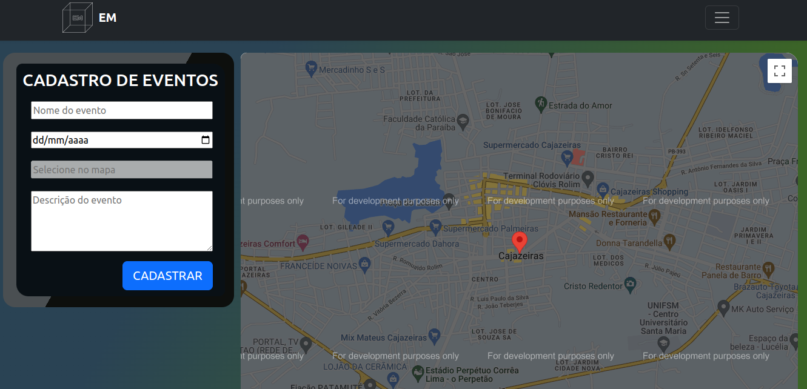

# 📌 *Event Maps* 

Este projeto é um exemplo de aplicação para WEB que gerencia o armazenamento de eventos em um banco de dados Postgres. Com a extensão postgis, ele armazena geográficos, sendo construído com Node.js, sequelize e express.

## Como utilizar 

Para iniciar a aplicação, siga os seguintes passos:

1. Faça o git clone "repositório" na sua máquina;
2. Instale o docker e os conteiners "postgis" e "pgadmin4";
3. Conecte com o servido criado em seu conteiner;
4. Instale as dependências do projeto a partir do "npm";
5. Inicie o projeto com "http://localhost:3000".

## Funções

A aplicação permite que o usuário realize as seguintes funções:

1. Visualizar e colocar um marcador no maps;
2. Informar o nome, data e descrição do evento a ser cadastrado;
3. Cadastrar um evento no banco de dados juntamente com o marcador(marker) do mapa;
4. Acessar e visualizar todos os eventos cadastrados no banco e os marcadores dos locais dos eventos.

## Tecnologias utilizadas

- Node.js
- Express
- Sequelise
- Bootstrap
- Postgres (SQL)

## Fazer parte do projeto

Se desejar contribuir com o projeto, bata apenas:

1. Faça um fork deste repositório.
2. Crie um branch para a suas alterações (`git checkout -b "nova-branch"`).
3. Faça as suas alterações.
4. Envie um pull request.

## Autores

- Israel Lázaro M Tavares (israellazaromt@gmail.com)

